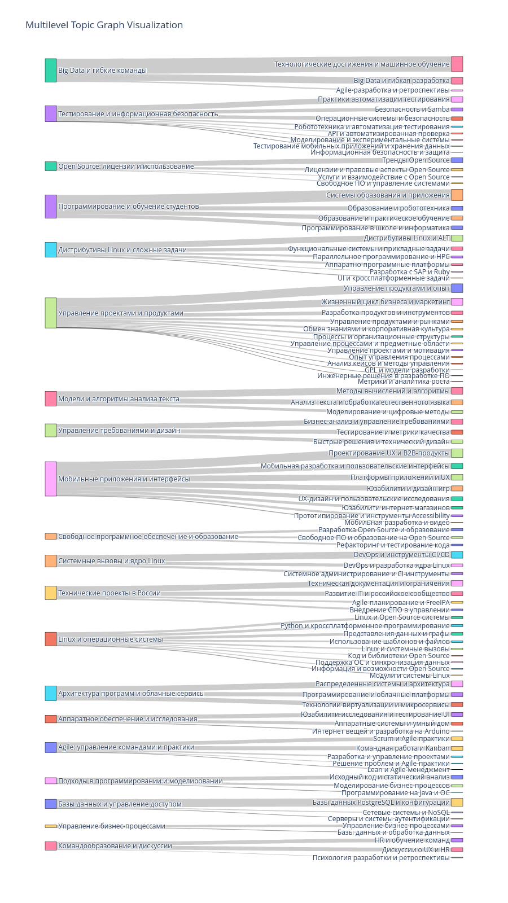

# mediawiki-autocategorization

Проект по автокатегоризации статей из [MediaWiki](https://0x1.tv/%D0%9C%D0%B5%D0%B4%D0%B8%D0%B0%D1%82%D0%B5%D0%BA%D0%B0) с использованием вероятностных тематических моделей

### Как запускать?

```bash
bash install-env39.sh
```

- training (in separate windows)
```
ollama run gemma2
python train.py
```
- inference
```
python inference.py
```

### Пример результатов

